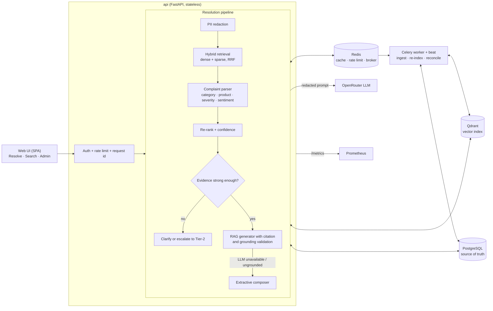

# Intelligent Support Ticket Resolution Assistant

A retrieval-augmented support assistant for telecom customer-care agents. An agent pastes a raw customer complaint and receives a structured analysis, the most similar resolved tickets and knowledge-base (KB) articles, and a **grounded, cited, step-by-step resolution** with a calibrated confidence score. When the evidence is weak or contradictory, the system asks a clarifying question or **escalates to Tier-2 instead of guessing**.

---

## Table of contents

1. [Problem statement](#1-problem-statement)
2. [Key features](#2-key-features)
3. [System architecture](#3-system-architecture)
4. [Technology stack](#4-technology-stack)
5. [Repository structure](#5-repository-structure)
6. [Getting started](#6-getting-started)
7. [API reference](#7-api-reference)
8. [Testing and evaluation](#8-testing-and-evaluation)
9. [Design decisions](#9-design-decisions)
10. [Limitations and known issues](#10-limitations-and-known-issues)
11. [Deployed Link](#11-deployed-link)
12. [Further documentation](#12-further-documentation)

---

## 1. Problem statement

Support agents lose time searching past tickets and documentation for a fix to a new complaint, and automated answers are only useful if they can be trusted. This project addresses four needs:

| Need | Approach |
|---|---|
| Understand a free-text complaint | Parse category / intent, product, severity and sentiment |
| Find relevant prior knowledge | Hybrid (dense + sparse) semantic search over resolved tickets and KB articles |
| Produce a trustworthy answer | Retrieval-augmented generation in which every step must cite a retrieved source |
| Keep working as data and issue types change | Idempotent ingestion, runtime ticket classes, blue/green re-indexing, drift monitoring; no retraining |

**Example input**

> *My broadband drops every evening around 8 and I've already restarted the router twice, I work from home and this is costing me*

**Output:** category and intent, product, severity (with the signals behind it), sentiment, ranked sources (`T1`, `K2`, ...), cited resolution steps, a calibrated confidence level, and an escalation flag where appropriate.

---

## 2. Key features

* **Complaint parsing:** category by similarity-weighted kNN over resolved tickets, plus intent, product, severity (with explainable signals) and sentiment.
* **Hybrid retrieval:** dense vectors for paraphrase, sparse (IDF) vectors for exact tokens such as error codes, fused with Reciprocal Rank Fusion.
* **Grounded generation:** the LLM must cite numbered sources; uncited or unsupported steps are dropped. Without an LLM key, a deterministic extractive composer drafts the steps from the sources, still cited.
* **Calibrated confidence:** based on whether the closest resolved cases prescribe the same fix, calibrated with a logistic fit and capped by a similarity gate, so off-topic text scores close to zero.
* **Safe failure modes:** clarifying questions when the closest cases disagree; escalation to Tier-2 when no reliable match exists.
* **Evolving data and classes:** idempotent ingestion, KB versioning, runtime class creation and merging, emerging-class mining, blue/green re-indexing, drift report, feedback promotion.
* **Operations:** role-based access (agent / admin), hash-chained audit log, PII redaction before storage and before any LLM call, Prometheus metrics and alert rules.
* **Web console:** single-page app with *Resolve*, *Search* and *Admin* tabs.

---

## 3. System architecture



**Source of truth versus derived index.** PostgreSQL holds all authoritative data; Qdrant is a disposable index that can be rebuilt at any time. This is what makes embedding-model upgrades and class merges (blue/green re-index) safe.

Full diagrams, including the `/v1/resolve` sequence, are in [`docs/ARCHITECTURE.md`](docs/ARCHITECTURE.md).

---

## 4. Technology stack

| Layer | Technology |
|---|---|
| API | Python 3.12, FastAPI, Uvicorn (Gunicorn in Docker), Pydantic v2, httpx |
| Relational store | PostgreSQL via SQLAlchemy 2 (SQLite for local runs) |
| Vector store | Qdrant (embedded mode for local runs) |
| Embeddings | `sentence-transformers/all-MiniLM-L6-v2`, or an offline hashing embedder (no download) |
| LLM | OpenRouter (`gpt-4o-mini`, fallback `claude-3.5-haiku`) |
| Background jobs | Celery + Redis (eager mode locally) |
| Auth / RBAC | Firebase Authentication (Google, email/password); PyJWT dev tokens for local use |
| Frontend | Plain JavaScript SPA, no build step |
| Observability | prometheus-client, Prometheus alert rules, JSON logs with request ids |
| Quality | pytest, ruff, jsdom UI tests, GitHub Actions |
| Packaging | Docker and Docker Compose |

---

## 5. Repository structure

```
app/
  api/            FastAPI application and routes
  core/           auth, embeddings, LLM client, vector store, PII, metrics, audit log
  services/       resolver, retriever, analyzer, confidence, rag, ingestion, indexer, taxonomy, drift
  worker/         Celery app and tasks
  db/             SQLAlchemy models and session handling
data/
  generate_synthetic.py   deterministic generator for the synthetic telecom corpus
  issue_catalog.py        issue definitions used by the generator
  handwritten/            hand-written evaluation sets
  load_hf.py              Hugging Face dataset import
evals/            evaluation harness with quality gates (run_all.py)
frontend/         single-page web console and UI tests
monitoring/       Prometheus configuration and alert rules
scripts/          seed, demo, load test, exploration, local run scripts
tests/            pytest suite
docs/             architecture, evaluation, production notes
```

---

## 6. Getting started

### 6.1 Prerequisites

* Python 3.12
* Git
* Optional: Docker Desktop (full stack), Node.js (UI tests)
* No API keys are required for the default local run.

### 6.2 Local run (no Docker, no keys)

**Windows PowerShell (one command)**

```powershell
cd ticket-resolution-assistant
.\scripts\run_local.ps1
```

The script creates `.venv`, installs dependencies, generates and seeds the telecom data, imports the Hugging Face dataset (needs internet once; a failure only prints a warning) and starts the app. Useful options: `-NoHF` (skip the Hugging Face import), `-Reset` (wipe local data), `-Port 8001`. If PowerShell blocks the script, run `Set-ExecutionPolicy -Scope CurrentUser RemoteSigned` first.

**Windows Command Prompt**

```bat
scripts\run_local.bat hashing nohf
```

**Manual steps (Linux, macOS, or Windows)**

```bash
python -m venv .venv
source .venv/bin/activate            # Windows: .\.venv\Scripts\Activate.ps1
pip install -r requirements-dev.txt

export EMBEDDING_BACKEND=hashing     # offline embedder, no model download
export AUTH_MODE=jwt
export JWT_SECRET=local-dev-secret
export DATABASE_URL=sqlite:///./local.db
export QDRANT_URL=path:./.qdrant
export CELERY_EAGER=true
export PYTHONUTF8=1

python -m scripts.seed               # generates data/synthetic/*.jsonl on first use, then loads it
python -m uvicorn app.api.main:app   # embedded Qdrant is single-process: no --reload, one worker
```

(On Windows PowerShell, replace each `export NAME=value` with `$env:NAME = "value"`; in `cmd.exe`, with `set NAME=value`.)

Open **http://localhost:8000/**, sign in with the **dev login as Admin**, and use the *Resolve* tab. Interactive API documentation is at `/docs`.

> **Synthetic data.** `data/synthetic/*.jsonl` is not stored in the repository. It is generated deterministically (fixed seed) by `python -m data.generate_synthetic`, and is created automatically the first time any script, test or evaluation needs it.

### 6.3 Full stack with Docker

```bash
cp .env.example .env                 # optionally set OPENROUTER_API_KEY for LLM drafting
docker compose up --build -d         # api, worker, beat, postgres, redis, qdrant
docker compose exec api python -m scripts.seed
docker compose --profile monitoring up -d    # optional: Prometheus on :9090
```

For a smaller image without PyTorch: `EMBEDDINGS=none EMBEDDING_BACKEND=hashing docker compose up --build -d`.

### 6.4 Real semantic embeddings

The default `hashing` embedder is a lexical, offline fallback that lets everything run anywhere. To use the real encoder:

```powershell
.\scripts\run_local.ps1 -Embeddings sentence-transformers -Reset
python -m evals.run_all --backend sentence-transformers --gates
```

Confidence thresholds are embedder-specific; re-fit them with `python -m evals.run_all --calibrate`.

### 6.5 Optional: Hugging Face dataset

```bash
pip install -r requirements-hf.txt
python -m data.load_hf --dry-run     # show detected columns and what would be imported
python -m data.load_hf               # import tickets and derived KB articles
```

This adds the public [`Tobi-Bueck/customer-support-tickets`](https://huggingface.co/datasets/Tobi-Bueck/customer-support-tickets) corpus next to the telecom data. Imported documents are labelled `HF` in the UI and API, and re-importing is idempotent. It can also be triggered from *Admin → Data*.

### 6.6 Optional: Google sign-in (Firebase)

Create a Firebase project, enable the Google provider, and add the web-app values to a `.env` file:

```
FIREBASE_API_KEY=...
FIREBASE_PROJECT_ID=...
ADMIN_EMAILS=you@company.com
ALLOWED_EMAIL_DOMAINS=company.com
```

Roles: a Firebase `role` claim wins; otherwise a verified email in `ADMIN_EMAILS` is **admin**; everyone else is **agent**.

---

## 7. API reference

Authenticated with a bearer token; roles are `agent` and `admin`. Interactive documentation is served at `/docs`.

| Endpoint | Role | Purpose |
|---|---|---|
| `POST /v1/resolve` | agent | Full pipeline: analysis, sources, cited steps, confidence, escalation |
| `POST /v1/analyze` | agent | Complaint parsing only |
| `POST /v1/search` | agent | Semantic search over tickets and KB |
| `POST /v1/feedback` | agent | Rating or correction; supplied steps become a new resolved ticket |
| `GET /v1/categories` | agent | Active ticket classes |
| `POST /v1/ingest/tickets`, `/v1/ingest/kb`; `GET /v1/jobs/{id}` | admin | Asynchronous, idempotent ingestion |
| `POST /v1/admin/categories`, `/{name}/merge` | admin | Add or merge a class |
| `POST /v1/admin/reindex`, `/v1/admin/seed-demo`, `/v1/admin/import-hf` | admin | Re-index, load demo data, import Hugging Face data |
| `GET /v1/admin/drift`, `/emerging`, `/stats`, `/jobs`, `/audit/verify` | admin | Health and operations |
| `GET /health`, `/ready`, `/metrics`, `/v1/config` | none | Liveness, readiness, Prometheus metrics, UI configuration |

---

## 8. Testing and evaluation

### 8.1 Commands

```bash
pytest -q                                   # unit, integration and API tests
ruff check app evals scripts tests data     # lint
python -m evals.run_all --gates             # offline evaluation with quality gates
python -m scripts.explore                   # exploratory data analysis (writes docs/EXPLORATION.md)
python -m scripts.loadtest --users 8 --requests 400   # requires the app to be running
```

UI tests (Node.js, jsdom, against a running server):

```bash
cd frontend/tests && npm install && node smoke.cjs http://localhost:8000
```

Generated outputs (`evals/reports/report.md`, `docs/EXPLORATION.md`, `docs/img/`, `data/synthetic/`) are produced by these commands.

### 8.2 Results

Measured on a clean run with the offline `hashing` embedder: **47 of 47 tests pass; 36 of 36 evaluation quality gates pass.**

| Evaluation set | Metric | Result |
|---|---|---|
| 96 held-out synthetic complaints | Recall@1 / Recall@5 / MRR (hybrid) | 0.323 / 0.604 / 0.440 |
| | nDCG@5 (hybrid) | 0.312 |
| 36 hand-written complaints | Recall@1 / Recall@5 / MRR (hybrid) | 0.861 / 0.972 / 0.903 |
| | nDCG@5 (hybrid) | 0.845 |
| | Category / product accuracy | 0.861 / 0.917 |
| | Step precision / gold-step recall | 0.821 / 0.883 |
| 29 short, vague queries | Top-1 on topic | 0.862 |
| | Answers free of unrelated departments | 0.862 |
| | Precision@5 | 0.739 |
| 132 complaints (confidence honesty) | Match-confidence calibration error | 0.060 |
| | Category calibration error | 0.041 |
| | Precision when confidence is *high* / *low* | 0.92 / 0.19 |
| | Monotonic calibration | True |
| | OOD mean confidence | 0.195 |
| 96 held-out synthetic complaints | KB recall@3 | 0.750 |
| | Category / product accuracy | 0.479 / 0.552 |
| | Sentiment accuracy | 0.729 |
| | Citation validity | 1.00 |
| | Step precision / gold-step recall | 0.338 / 0.362 |
| | OOD complaints escalated | 0.875 |
| | Novel-class accuracy after addition | 0.333 |
| Latency (in-process, no LLM) | p50 / p95 | 70.7 ms / 93.0 ms |
| Throughput | 1-thread | 13.6 requests/s |

The evaluation methodology, metric definitions and online health alerts are described in [`docs/EVALS.md`](docs/EVALS.md).

---

## 9. Design decisions

* **Category by kNN over resolved tickets, not a trained classifier.** A new class works as soon as a few seed tickets are indexed; adding classes needs no retraining.
* **"Unknown" requires similarity and agreement.** A complaint is treated as a known class if it is clearly similar, or weakly similar with at least 65% of the neighbour vote on one class. This raised hand-written category accuracy from 0.61 to 0.83 without hurting novel-class detection.
* **Hybrid retrieval.** Dense vectors capture paraphrase; sparse vectors preserve exact tokens such as `PUK` or `LOS`.
* **Never invent an answer.** Every step must cite a retrieved source and be lexically supported by it, otherwise it is dropped. Below a calibrated similarity the case is escalated.
* **Confidence reflects agreement, not raw similarity.** Raw similarity was a poor trust signal (wrong top matches sometimes scored higher than right ones). Confidence is the calibrated probability that the closest cases prescribe the same fix; "same fix" is judged by step wording overlap or by semantic similarity of the step text.
* **PostgreSQL is the source of truth; Qdrant is disposable.** This makes re-indexing and model upgrades safe.
* **Transparent heuristics for severity and sentiment**, so agents can see why a ticket was rated *high* (`severity_signals`).

---

## 10. Limitations and known issues

* Confidence constants were fitted on the offline embedder and a limited number of complaints; the *medium* confidence band remains less reliable than the high-confidence band (stated about 0.56, correct about 0.35). Re-fit with `--calibrate` for any other embedder.
* An off-topic query that genuinely resembles an indexed ticket (for example, a streaming-service password reset versus router-password tickets) can still be answered with high confidence.
* The Hugging Face dataset is a general support corpus, not telecom-specific.

---

## 11. Deployed Link

**Public Preview:** [Ticket Resolution Assistant](https://ticket-resolution-assistant.onrender.com/ui/)

The public deployment currently provides a frontend preview and authentication entry point. The complete backend/RAG pipeline is available through the local deployment setup.

---

## 12. Further documentation

* [Architecture](docs/ARCHITECTURE.md): system view, request sequence, trust layer
* [Evaluations](docs/EVALS.md): methodology, metrics, online health alerts
