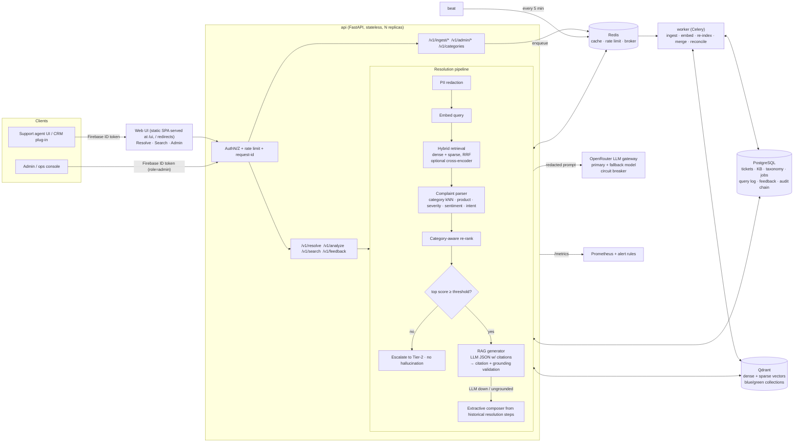
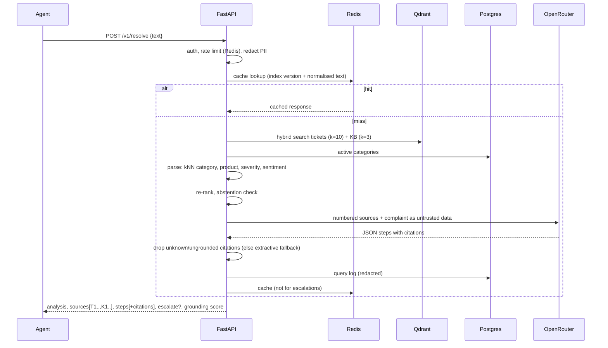

# Architecture

## 1. System view

**Source of truth vs. derived index.** PostgreSQL holds everything that matters; Qdrant is a *derived* index that can be rebuilt
at any time (`/v1/admin/reindex`). That is what makes model upgrades, class merges and recovery safe.

## 2. `/v1/resolve` sequence

## 2b. Trust layer, Hugging Face data and sign-in
* **Retrieval vectors** ignore generic complaint words and strip greetings/sign-offs (`core/text.py`), so a short query such as "wifi not working" is matched on *wifi*, not on "working".
* **Confidence** (`services/confidence.py`): tickets whose resolution steps overlap form fix groups; `agreement` = weight of the leading group; `confidence = sigmoid(slope*agreement + bias) x similarity_gate`. Low confidence => clarifying question built from the competing groups; below `MIN_CONFIDENCE` => escalate. Results below the abstain floor or far weaker than the best are not shown. Metrics: `resolve_match_confidence`, `resolve_low_confidence_total` (alerts in `monitoring/alerts.yml`).
* **Domain profile** (`app/domains/*.json`): products, outage phrases and dataset queues are data, not code.
* **Hugging Face import** (`services/hf_import.py`, `data/load_hf.py`, `POST /v1/admin/import-hf`): rows -> cleaned resolved tickets (`hf-*`) and derived KB articles (`kb-hf-*`), indexed through the same idempotent ingestion; `origin` is derived from the id prefix, so no schema change.
* **Auth** (`core/auth.py`): Firebase ID tokens (Google or password) are verified server-side; role = `role` claim, else verified email in `ADMIN_EMAILS` -> admin, else `agent`; `ALLOWED_EMAIL_DOMAINS` gates entry. In `jwt` mode Firebase tokens are accepted beside dev tokens.

## 3. Evolving data and classes

| Change in the world | Mechanism | Retraining? |
|---|---|---|
| New resolved tickets / edited tickets | Idempotent upsert by `external_id` + content hash; only changed rows are re-embedded (`/v1/ingest/tickets`, feedback promotion) | no |
| KB article edited / retired | Chunks replaced atomically; `active=false` removes vectors | no |
| **New ticket class** | `POST /v1/admin/categories` with a few seed tickets → kNN classifier predicts it as soon as they are indexed. Unseen-class complaints are logged as `unknown` and clustered at `/v1/admin/emerging` to suggest *which* class to create | **no** |
| Classes merged / renamed | `POST /v1/admin/categories/{n}/merge` rewrites DB + vector payloads; stale producers are redirected | no |
| New embedding model | Blue/green re-index into `collection_vN+1` from Postgres, catch-up pass, atomic pointer flip; serving embeds queries with the *active index's* embedder; thresholds re-calibrated (`evals.run_all --calibrate`) | re-embed only |
| Vector DB was down during ingest | `beat` runs `reconcile_unindexed` every 5 min | no |
| Distribution shift | `/v1/admin/drift` + Prometheus alerts on unknown-rate, top-1 similarity, escalation rate, helpful ratio | – |

## 4. Data model (PostgreSQL)

`tickets`, `kb_articles`, `categories` (taxonomy, merge pointers), `index_state` (active collection + embedder spec),
`ingest_jobs`, `query_logs` (redacted), `feedback`, `audit_log` (hash-chained, tamper-evident).

